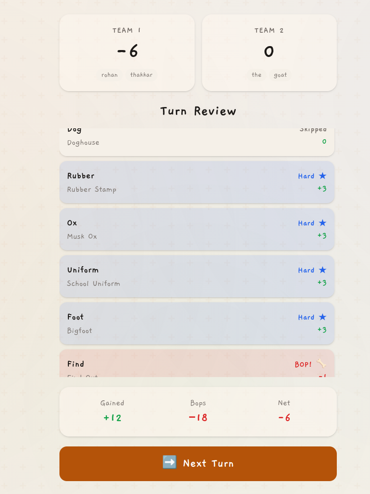
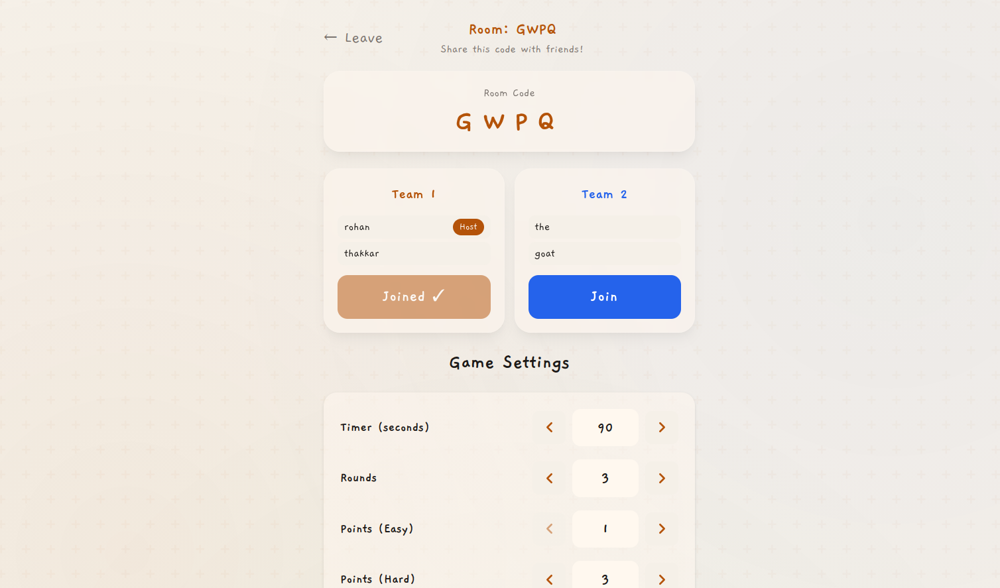
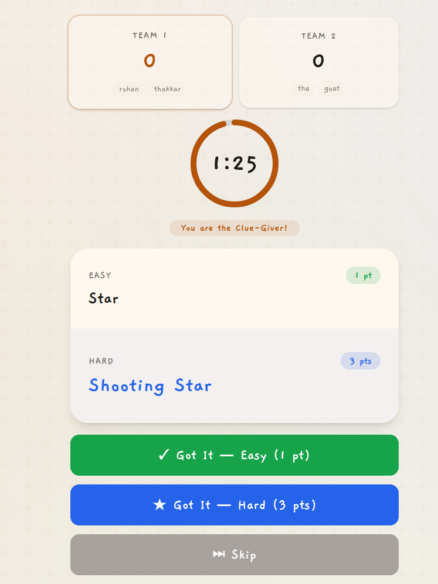
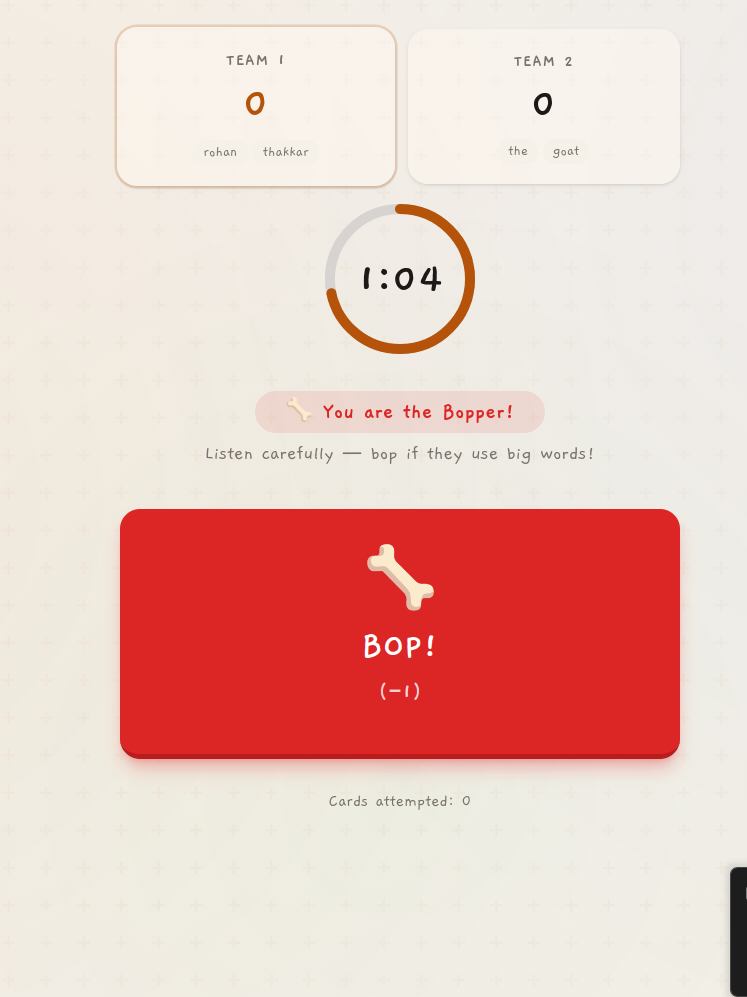

# Poetry for Neanderthals
Clone of the popular party game "[Poetry for Neanderthals](https://www.explodingkittens.com/products/poetry-for-neanderthals)" with support for both single-device and multiplayer modes as well as configurable rule values.

## Modes
- **Pass-and-Play:** Perfect for playing in the same room with a single phone or tablet
- **Remote Play:** Create a room and invite friends via a 4-letter code. Supports voice chat for players <= 8

## How?
- This repo uses Full Mesh voice chat, which means direct P2P connections from each device to another due to cost and network limitations on my end. We use Google's public STUN servers to help establish WebRTC connections using this repo's server as a signaling server.
- Audio processing using the Web Audio API to allow for changing individual user volumes and automatically boosting the current Poet.

## Setup
You must have either Bun or NPM installed, and ideally Docker for containerized deployment.

Run using Docker (Recommended):
```bash
docker-compose up --build
```
This will automatically install dependencies, build the SvelteKit UI, and start the server.

Run from source using Bun:
   ```bash
   git clone https://github.com/r-thak/PoetryForNeanderthals
   cd PoetryForNeanderthals
   bun install
   bun run start  # Automatically builds and starts the server
   ```

By default, the app will be available at `http://localhost:22222` for both Docker and (production) source deployments.

## Screenshots

<div align="center">
  
  
  
  
</div>